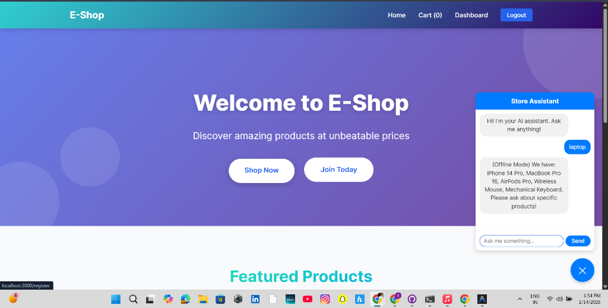
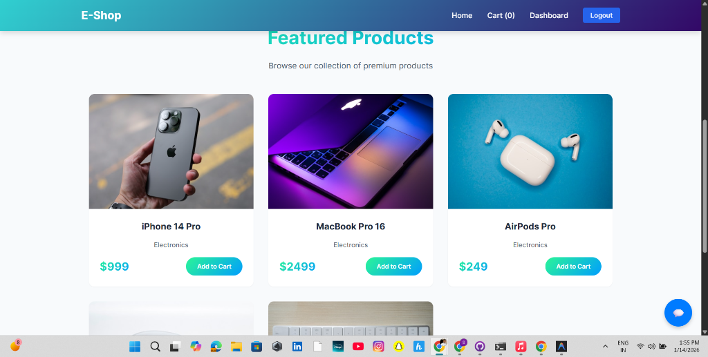
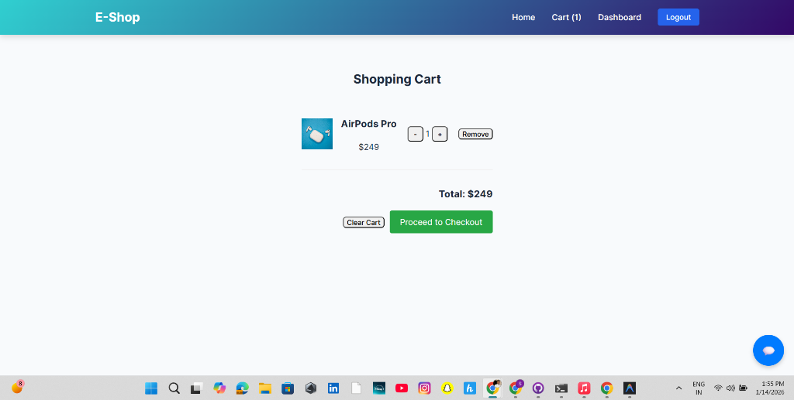
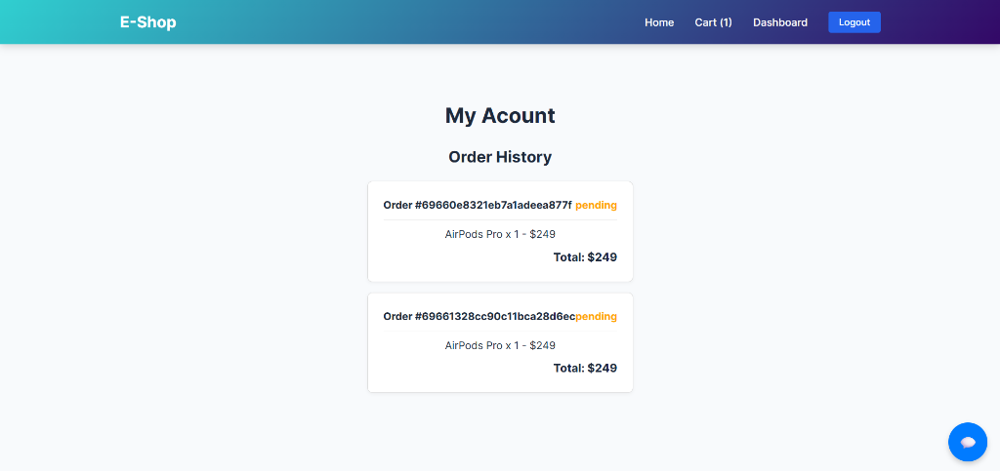

# E-Commerce Platform

A full-stack e-commerce application built with the MERN stack (MongoDB, Express.js, React, Node.js), featuring user authentication, product management, shopping cart functionality, payment integration, and AI-powered chat support.

## 🌐 Live Demo

**Experience the live application deployed on Vercel:**

- 🚀 **Frontend (Live)**: [https://frontend-48ec0whzt-shishagra-nigam19s-projects.vercel.app](https://frontend-48ec0whzt-shishagra-nigam19s-projects.vercel.app)
- 🔧 **Backend API**: [https://backend-six-nu-58.vercel.app](https://backend-six-nu-58.vercel.app)

> **Note**: The application is currently deployed. The frontend loads successfully, and backend API is being configured for production use.

## 💻 Local Developement

Running locally? Access the application here:

- 🏠 **Frontend (Local)**: [http://localhost:3000](http://localhost:3000)
- ⚙️ **Backend API (Local)**: [http://localhost:5000](http://localhost:5000)

## ✨ Features

## 📸 Screenshots

| Home Page | Featured Products |
|-----------|-------------------|
|  |  |

| Shopping Cart | Checkout |
|---------------|----------|
|  |  |

| User Dashboard |
|----------------|
|  |

### User Features
- 🔐 **User Authentication**: Secure registration and login with JWT
- 🛍️ **Product Browsing**: Browse and search products with detailed views
- 🛒 **Shopping Cart**: Add, update, and remove items from cart
- 💳 **Secure Checkout**: Complete orders with Razorpay payment integration
- 📊 **Order History**: View past orders and order status
- 💬 **AI Chat Support**: Get product recommendations and support via OpenAI integration

### Admin Features
- 📦 **Product Management**: Add, edit, and delete products
- 📋 **Bulk Upload**: Import products via CSV/Excel files
- 👥 **User Management**: View and manage registered users
- 📈 **Order Management**: View and process customer orders

## 🛠️ Tech Stack

### Frontend
- **React** 18.2.0 - UI library
- **React Router DOM** 6.18.0 - Client-side routing
- **Axios** - HTTP client for API requests
- **XLSX** - Excel file handling for bulk uploads

### Backend
- **Node.js** with **Express.js** - Server framework
- **MongoDB** with **Mongoose** - Database and ODM
- **JWT** - Authentication tokens
- **bcryptjs** - Password hashing
- **Multer** - File upload handling
- **Razorpay** - Payment gateway integration
- **OpenAI** - AI chat support
- **CORS** - Cross-origin resource sharing

## 📁 Project Structure

```
E-COMMERCE/
├── backend/
│   ├── config/          # Configuration files
│   ├── controllers/     # Route controllers
│   ├── middlewares/     # Custom middleware (auth, etc.)
│   ├── models/          # MongoDB models (User, Product, Order)
│   ├── routes/          # API routes
│   ├── services/        # Business logic services
│   ├── uploads/         # Uploaded files storage
│   ├── server.js        # Express server setup
│   └── package.json
│
└── frontend/
    ├── public/          # Static files
    ├── src/
    │   ├── api/         # API service layer
    │   ├── components/  # Reusable React components
    │   ├── context/     # React Context API
    │   ├── pages/       # Page components
    │   ├── App.js       # Main app component
    │   └── index.js     # Entry point
    └── package.json
```

## 🚀 Getting Started

### Prerequisites
- Node.js (v14 or higher)
- MongoDB (local or MongoDB Atlas)
- Razorpay account (for payment integration)
- OpenAI API key (for chat support)

### Installation

1. **Clone the repository**
   ```bash
   git clone https://github.com/Shishagra-Nigam19/E-COMMERCE.git
   cd E-COMMERCE
   ```

2. **Backend Setup**
   ```bash
   cd backend
   npm install
   ```

   Create a `.env` file in the backend directory:
   ```env
   PORT=5000
   MONGO_URI=your_mongodb_connection_string
   JWT_SECRET=your_jwt_secret_key
   RAZORPAY_KEY_ID=your_razorpay_key_id
   RAZORPAY_KEY_SECRET=your_razorpay_key_secret
   OPENAI_API_KEY=your_openai_api_key
   ```

   Start the backend server:
   ```bash
   npm start
   # or for development with auto-reload
   npm run dev
   ```

3. **Frontend Setup**
   ```bash
   cd ../frontend
   npm install
   ```

   Create a `.env` file in the frontend directory:
   ```env
   REACT_APP_API_URL=http://localhost:5000
   ```

   Start the React app:
   ```bash
   npm start
   ```

4. **Access the application**
   - Frontend: http://localhost:3000
   - Backend API: http://localhost:5000

## 🌐 Deployment

Ready to deploy your application to production? We support deployment to **Vercel** for both frontend and backend.

### Quick Deploy

```bash
# Install Vercel CLI
npm install -g vercel

# Login to Vercel
vercel login

# Deploy backend
cd backend
vercel --prod

# Deploy frontend
cd ../frontend
vercel --prod
```

### Automated Deployment

Use our deployment scripts:

```powershell
# Deploy backend
.\deploy-backend.ps1

# Deploy frontend  
.\deploy-frontend.ps1
```

### 📚 Deployment Documentation

For complete deployment instructions, troubleshooting, and best practices:
- **[Quick Start: DEPLOYMENT.md](DEPLOYMENT.md)** - Quick deployment guide
- **[Full Guide](DEPLOYMENT.md)** - Comprehensive deployment documentation

### Deploy via GitHub

1. Push your code to GitHub
2. Connect to [Vercel Dashboard](https://vercel.com/dashboard)
3. Import repository and configure
4. Automatic deployments on every push!


## 📝 API Endpoints

### Authentication
- `POST /api/auth/register` - Register new user
- `POST /api/auth/login` - User login

### Products
- `GET /api/products` - Get all products
- `GET /api/products/:id` - Get single product
- `POST /api/products` - Create product (Admin)
- `PUT /api/products/:id` - Update product (Admin)
- `DELETE /api/products/:id` - Delete product (Admin)
- `POST /api/products/bulk-upload` - Bulk upload products (Admin)

### Orders
- `GET /api/orders` - Get user orders
- `POST /api/orders` - Create new order
- `GET /api/orders/:id` - Get order details
- `PUT /api/orders/:id` - Update order status (Admin)

### Payment
- `POST /api/payment/create-order` - Create Razorpay order
- `POST /api/payment/verify` - Verify payment

### Chat
- `POST /api/chat` - Send message to AI assistant

## 🧪 Testing

Run backend tests:
```bash
cd backend
npm test
```

## 📦 Bulk Product Upload

Admins can upload products in bulk using CSV or Excel files. The file should have the following columns:
- `name` - Product name
- `description` - Product description
- `price` - Product price
- `category` - Product category
- `stock` - Available quantity
- `imageUrl` - Product image URL (optional)

## 🔐 Environment Variables

### Backend (.env)
| Variable | Description |
|----------|-------------|
| `PORT` | Server port (default: 5000) |
| `MONGO_URI` | MongoDB connection string |
| `JWT_SECRET` | Secret key for JWT tokens |
| `RAZORPAY_KEY_ID` | Razorpay API key ID |
| `RAZORPAY_KEY_SECRET` | Razorpay API secret key |
| `OPENAI_API_KEY` | OpenAI API key for chat |

### Frontend (.env)
| Variable | Description |
|----------|-------------|
| `REACT_APP_API_URL` | Backend API URL |

## 👤 User Roles

- **Customer**: Browse products, add to cart, place orders, view order history
- **Admin**: All customer features + product management, user management, order management

## 🤝 Contributing

Contributions are welcome! Please feel free to submit a Pull Request.

1. Fork the repository
2. Create your feature branch (`git checkout -b feature/AmazingFeature`)
3. Commit your changes (`git commit -m 'Add some AmazingFeature'`)
4. Push to the branch (`git push origin feature/AmazingFeature`)
5. Open a Pull Request

## 📄 License

This project is open-source and available under the [MIT License](LICENSE).

## 📧 Contact

For any questions or suggestions, please open an issue or contact the repository owner.

## 🙏 Acknowledgments

- [React Documentation](https://reactjs.org/)
- [Express.js](https://expressjs.com/)
- [MongoDB](https://www.mongodb.com/)
- [Razorpay Documentation](https://razorpay.com/docs/)
- [OpenAI API](https://platform.openai.com/)

---

**Happy Shopping! 🛍️**
